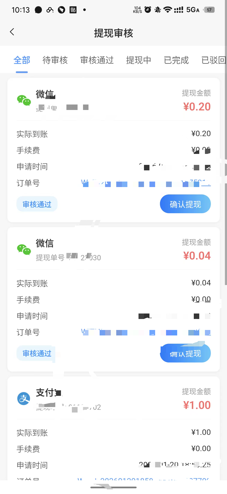

# 微信转账 SDK UniApp 原生插件使用文档

## 插件信息

| 属性 | 值 |
|------|-----|
| 插件名称 | 微信转账sdk |
| 插件ID | wx_transfer |
| 版本 | 1.0.0 |
| 支持平台 | Android |
| 最低SDK版本 | 21 (Android 5.0) |

## 安装配置
### 效果图

<table>
<tr>
<td></td>
<td></td>
</tr>
</table>
### 1. 导入插件

**步骤一：解压插件包**

找到项目中的 `uni-plugin/wx_transfer_uni.zip` 压缩包，将其解压。

**步骤二：复制到项目目录**

将解压后的 `wx_transfer_uni` 文件夹完整复制到你的 UniApp 项目的 `nativeplugins` 目录下：

```
你的UniApp项目/
├── nativeplugins/
│   └── wx_transfer_uni/
│       ├── android/
│       │   └── uni-wx-transfer-release.aar
│       └── package.json
├── pages/
├── static/
├── App.vue
└── manifest.json
```

> **提示**：如果你的项目中没有 `nativeplugins` 目录，请新建一个。

### 2. 配置 manifest.json

在 HBuilderX 中打开 `manifest.json`，选择 **App原生插件配置**：

1. 点击 **选择本地插件**
2. 勾选 `微信转账sdk`
3. 保存配置

或者手动在 `manifest.json` 中添加：

```json
{
  "app-plus": {
    "nativePlugins": {
      "wx_transfer": {
        "android": {
          "plugins": [{
            "type": "module",
            "name": "wx_transfer_uni",
            "class": "com.uniplugin.wx_transfer.WXTransferModule"
          }]
        }
      }
    }
  }
}
```

## 使用方法

### 1. 引入插件模块

```javascript
// 获取原生插件模块
const wxTransfer = uni.requireNativePlugin('wx_transfer_uni')
```

### 2. 基本调用示例

```vue
<template>
  <view class="container">
    <button @click="handleTransfer">发起微信转账</button>
  </view>
</template>

<script>
export default {
  data() {
    return {
      wxTransfer: null
    }
  },
  onLoad() {
    // 初始化插件
    this.wxTransfer = uni.requireNativePlugin('wx_transfer_uni')
  },
  methods: {
    handleTransfer() {
      if (!this.wxTransfer) {
        uni.showToast({
          title: '插件加载失败',
          icon: 'none'
        })
        return
      }

      // 调用微信商家转账接口
      this.wxTransfer.requestMerchantTransfer(
        'your_app_id',        // 微信 appId
        'your_mch_id',        // 商户号
        'your_package_info',  // package 信息（由后端生成）
        'user_open_id',       // 用户 openId
        (res) => {
          // 回调处理
          const data = typeof res === 'string' ? JSON.parse(res) : res

          if (data.errCode === 0) {
            uni.showToast({
              title: '调起成功',
              icon: 'success'
            })
          } else {
            uni.showToast({
              title: data.errMsg || '调用失败',
              icon: 'none'
            })
          }
        }
      )
    }
  }
}
</script>
```

#### 参数说明

| 参数 | 类型 | 必填 | 说明 |
|------|------|------|------|
| appId | String | 是 | 微信 appId |
| mchId | String | 是 | 微信支付商户号 |
| packageInfo | String | 是 | 转账 package 信息（需后端接口生成） |
| openId | String | 是 | 用户的微信 openId |
| callback | Function | 是 | 回调函数 |

#### 回调结果

```javascript
{
  "errCode": 0,     // 0:成功, -1:上下文错误, -3:未安装微信, -4:微信版本过低, -5:发送失败, -99:其他错误
  "errMsg": "ok"    // 结果描述
}
```

## 注意事项

1. **仅支持 Android 平台**：该插件目前只提供 Android 版本的 aar 包

2. **真机调试**：原生插件必须在真机上运行，模拟器和浏览器无法使用

3. **自定义基座**：开发调试时需要制作自定义基座：
   - HBuilderX 菜单：运行 → 运行到手机或模拟器 → 制作自定义调试基座

4. **云打包**：正式发布时使用云打包或离线打包

5. **条件编译**：建议使用条件编译处理多平台兼容：
   ```javascript
   // #ifdef APP-PLUS
   const wxTransfer = uni.requireNativePlugin('wx_transfer_uni')
   // #endif
   ```

## 常见问题

### Q: 提示"插件不存在"？

A: 请检查：
- 插件是否正确放置在 `nativeplugins` 目录
- `manifest.json` 是否正确配置
- 是否使用自定义基座运行

### Q: 调用方法无响应？

A: 请确认：
- 在真机环境运行
- 插件模块名称是否正确（`wx_transfer_uni`）
- 查看原生日志排查问题

## 更新日志

### v1.0.0
- 初始版本发布
